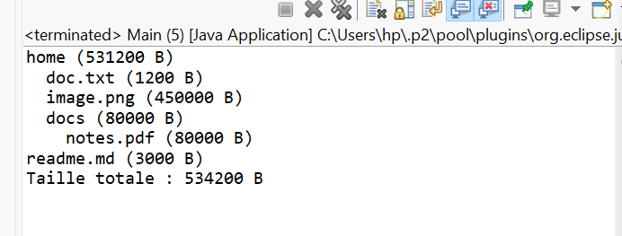

# TP7 : Classes Abstraites  
## Exercice 1 : Gestion de la paie des employés  

###  Objectif
Consolider la maîtrise des **classes abstraites** et du **polymorphisme** en modélisant un système de calcul de salaire pour différents types d’employés.

---

###  Plan de modélisation

#### **Classes**
- `Employe` *(abstraite)*
- `EmployeHoraire` *(extends Employe)*
- `EmployeSalarie` *(extends Employe)*
- `Vendeur` *(extends EmployeSalarie)*
- `Entreprise` *(gestion du tableau d’employés)*
- `Main` *(programme de test)*

---

###  Détails des classes

#### **Employe (abstraite)**
| Attributs | Description |
|------------|-------------|
| `protected String nom` | Nom de l’employé |
| `protected String prenom` | Prénom de l’employé |

**Méthodes :**
- `public Employe(String nom, String prenom)`
- `public abstract double calculerSalaire()`
- `public String toString()`

---

#### **EmployeHoraire**
| Attributs | Description |
|------------|-------------|
| `private double tauxHoraire` | Salaire horaire |
| `private double heuresTravaillees` | Nombre d’heures travaillées |

**Méthodes :**
- `calculerSalaire() = tauxHoraire * heuresTravaillees`

---

#### **EmployeSalarie**
| Attributs | Description |
|------------|-------------|
| `private double salaireMensuel` | Salaire fixe mensuel |

**Méthodes :**
- `calculerSalaire() = salaireMensuel`

---

#### **Vendeur**
| Attributs | Description |
|------------|-------------|
| `private double commission` | Montant de la commission |

**Méthodes :**
- `calculerSalaire() = salaireMensuel + commission`

---

#### **Entreprise**
| Attributs | Description |
|------------|-------------|
| `private Employe[] employes` | Tableau dynamique d’employés |
| `private int nb` | Nombre d’employés enregistrés |

**Méthodes :**
- `ajouterEmploye(Employe e)`  
- `afficherPaie()`  
- `masseSalariale()`  

---
##  Exemple d’exécution
```
=== Bulletin de paie ===
El Idrissi Mohamed → Salaire = 2400.00€
Bentaleb Fatima → Salaire = 2500.00€
Chouaib Youssef → Salaire = 2500.00€
Lahlou Salma → Salaire = 1440.00€
Masse salariale totale : 8840.00€


```
## Exemple d’exécution (image)

Voici un exemple de l'exécution du programme (screenshot) :


Voici un exemple de l'exécution du programme (screenshot) :




## Exercice 2 : Modélisation d’un système de fichiers  

###  Objectif
Apprendre à définir et utiliser des **classes abstraites** en Java en modélisant un **mini-système de fichiers** où chaque élément (`FsItem`) peut être un **fichier** ou un **répertoire** capable de calculer sa taille.

---


###  Plan de modélisation

#### **Classes**
- `FsItem` *(abstraite)*
- `FileItem` *(extends FsItem)*
- `Directory` *(extends FsItem)*
- `FileSystem` *(gestion du tableau d’éléments racine)*
- `Main` *(programme de test)*

---

###  Détails des classes

#### **FsItem (abstraite)**
| Attributs | Description |
|------------|-------------|
| `protected String name` | Nom du fichier ou du répertoire |

**Méthodes :**
- `public FsItem(String name)`  
- `public abstract long getSize()`  
- `public String getName()`  
- `public String toString()` → affiche `name (taille)`

---

#### **FileItem**
| Attributs | Description |
|------------|-------------|
| `private long size` | Taille en octets du fichier |

**Méthodes :**
- `getSize() => size`

---

#### **Directory**
| Attributs | Description |
|------------|-------------|
| `private FsItem[] children` | Tableau dynamique des éléments enfants |
| `private int count` | Nombre d’éléments |

**Méthodes :**
- `add(FsItem item)` → ajoute un enfant (double la taille du tableau si plein)  
- `getSize()` → additionne récursivement la taille des enfants  
- `list(int indent)` → affiche récursivement l’arborescence avec indentation  

---

#### **FileSystem**
| Attributs | Description |
|------------|-------------|
| `private FsItem[] items` | Tableau d’éléments racine |
| `private int count` | Nombre d’éléments racine |

**Méthodes :**
- `addRoot(FsItem item)` → ajoute un élément racine  
- `listAll()` → affiche tous les éléments racine et leur contenu  
- `totalSize()` → calcule la taille totale de tous les éléments racine  

---
 ## Exemple d’exécution
 ```
home (531200 B)
  doc.txt (1200 B)
  image.png (450000 B)
  docs (80000 B)
    notes.pdf (80000 B)
readme.md (3000 B)
Taille totale : 534200 B

 ```

## Exemple d’exécution (image)

Voici un exemple de l'exécution du programme (screenshot) :


